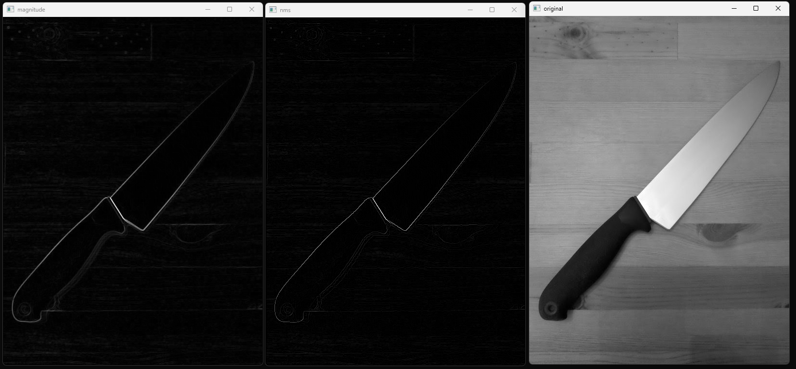

# Prewitt edge detector: gradient filter és nonmaxima-suppression (NMS)
 
# Compile

OpenCV, CMake

# Run

main.exe img.png

# Output
Output is two images: 1. gradient magnitute; 2. final result after NMS.

